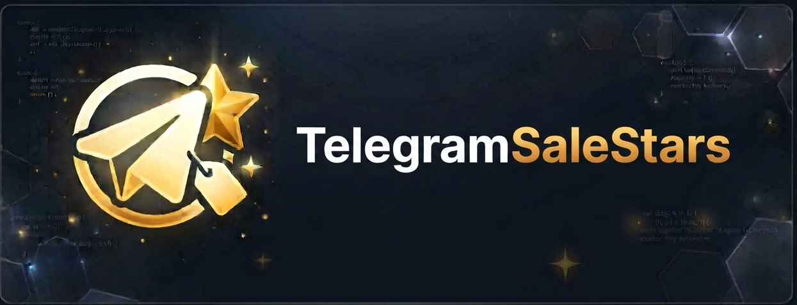

# TelegramSaleStars

TelegramSaleStars — стильный и надёжный Telegram-бот для продажи виртуальных «звёзд». Пользователи могут купить звёзды через CryptoBot (Crypto Pay), оплатить счёт и получить доставку/назначение звёзд на указанный аккаунт; владелец бота получает статистику и инструменты администрирования.

 <!-- по желанию: добавьте изображение в assets/header.png -->

---

## Стек
- Язык: Python 
- РUNTIME / Фреймворк: aiogram (v3)
- Ключевые зависимости: aiogram, aiosqlite, aiocryptopay, pytoniq (см. requirements.txt)

---

## Что реализовано
- Оформление заказа на покупку звёзд (интерактивный диалог, FSM).
- Приём оплаты через CryptoBot (Crypto Pay).
- SQLite (aiosqlite) для пользователей, заказов и статистики.
- Админ-панель: статистика, рассылка, ручная корректировка баланса.
- Интеграция с TON (ton_client.py) и контрактом Fragment.

---

## Структура проекта
```
config.py            # Конфигурация: BOT_TOKEN, CRYPTO_BOT_TOKEN, ADMIN_ID и др. (оставляем как есть)
requirements.txt     # Зависимости
main.py              # Точка входа — инициализация БД и запуск polling
database.py          # Работа с SQLite (users, orders, stats)
ton_client.py        # Интеграция с TON (кошелёк/контракт)
keyboards.py         # Клавиатуры (main, inline, admin)
states.py            # FSM StatesGroup для покупок/депозита/админ-операций
handlers/            # Хендлеры (start, payment, stars, admin)
  start.py
  payment.py
  stars.py
  admin.py
bot_database.db      # (создаётся автоматически при первом запуске)
```
---

## Как это работает (кратко)
- main.py инициализирует БД (database.init_db()) и подключает роутеры из handlers.
- Пользователь выбирает действие в клавиатуре (keyboards.py). Процесс покупки идёт через состояния (states.py).
- При создании счёта используется aiocryptopay; после подтверждённой оплаты создаётся запись в orders и при необходимости выполняется действие через ton_client.py.
- Админ управляет ботом через специальные команды/меню в handlers/admin.py.

---

## Быстрый старт (локально)
1. Клонировать и перейти в директорию:
   ```bash
   git clone https://github.com/Ghostoraner/TelegramSaleStars.git
   cd TelegramSaleStars
   ```
   
2. Виртуальное окружение и установка зависимостей:
   ```bash
   python -m venv venv
   source venv/bin/activate   # Linux/macOS
   venv\Scripts\activate      # Windows (PowerShell)
   pip install -r requirements.txt
   ```
 
3. Настройка:
   Откройте config.py и заполните:
   - BOT_TOKEN — токен бота от @BotFather
   - CRYPTO_BOT_TOKEN — токен из @CryptoBot (Crypto Pay -> My Apps)
   - ADMIN_ID — ваш Telegram user_id
   - SUPPORT_USERNAME — логин для кнопки "Написать админу" (без @ или с @, как вам удобно)
   - STAR_PRICE — цена за одну звезду
   - WALLET_MNEMONIC — 24 слова TON (НИКОМУ не раскрывать)
   - FRAGMENT_CONTRACT — адрес контракта (оставить как есть, если не меняете)

   Важно: не коммитьте реальные токены/мнемоники в публичные репозитории.

4. Запуск:
   ```bash
   python main.py
   ```
   
   При первом запуске создаётся файл SQLite `bot_database.db`.

---   

## Docker — базовая настройка

Рекомендуемая схема — собрать образ на основе slim-версии Python и запускать контейнер с томом для сохранения БД.

Пример Dockerfile (универсальный, для Linux/Windows Docker Desktop тоже подходит):
```dockerfile
# Dockerfile
FROM python:3.11-slim
WORKDIR /app
COPY requirements.txt .
RUN pip install --no-cache-dir -r requirements.txt
COPY . .
# Рекомендуется НЕ хранить секреты в образе; используйте файлы конфигурации/volumes или env.
CMD ["python", "main.py"]
```

Пример docker-compose.yml:
```yaml
version: "3.8"
services:
  bot:
    build: .
    restart: unless-stopped
    volumes:
      - ./bot_data:/app  # том для хранения bot_database.db и config.py (локально)
    environment:
      # Если захотите переключиться на env-переменные, перечислите их здесь
      # BOT_TOKEN: "..."
    networks:
      - botnet

networks:
  botnet:
    driver: bridge
```

Инструкции по запуску (Linux):
- Собрать образ:
  docker build -t telegramsalestars:latest .
- Запустить:
  docker run -d --name telegramsalestars -v $(pwd)/bot_data:/app telegramsalestars:latest

Инструкции по запуску (Windows PowerShell):
- Собрать образ:
  docker build -t telegramsalestars:latest .
- Запустить:
  docker run -d --name telegramsalestars -v ${PWD}\bot_data:/app telegramsalestars:latest

Примечания:
- На Windows путь тома в PowerShell — ${PWD}\bot_data; в CMD используйте %cd%\bot_data.
- Убедитесь, что config.py с заполненными настройками доступен внутри контейнера (например, смонтирован в ./bot_data или передан иным способом). По соображениям безопасности лучше передавать секреты через менеджер секретов / переменные окружения.

---

## Администрирование и команды
- Основная админ-логика — в handlers/admin.py. Админ-панель доступна только пользователю с ADMIN_ID.
- Команды: статистика, рассылка, изменение баланса — реализованы через меню и состояния.

---

## Рекомендации по безопасности
- Перенести секреты из config.py в переменные окружения или в файл, не попадающий в репозиторий.
- Использовать .gitignore для исключения локальных секретов и bot_database.db.
- Резервные копии базы данных, если вы храните данные реальных пользователей.


